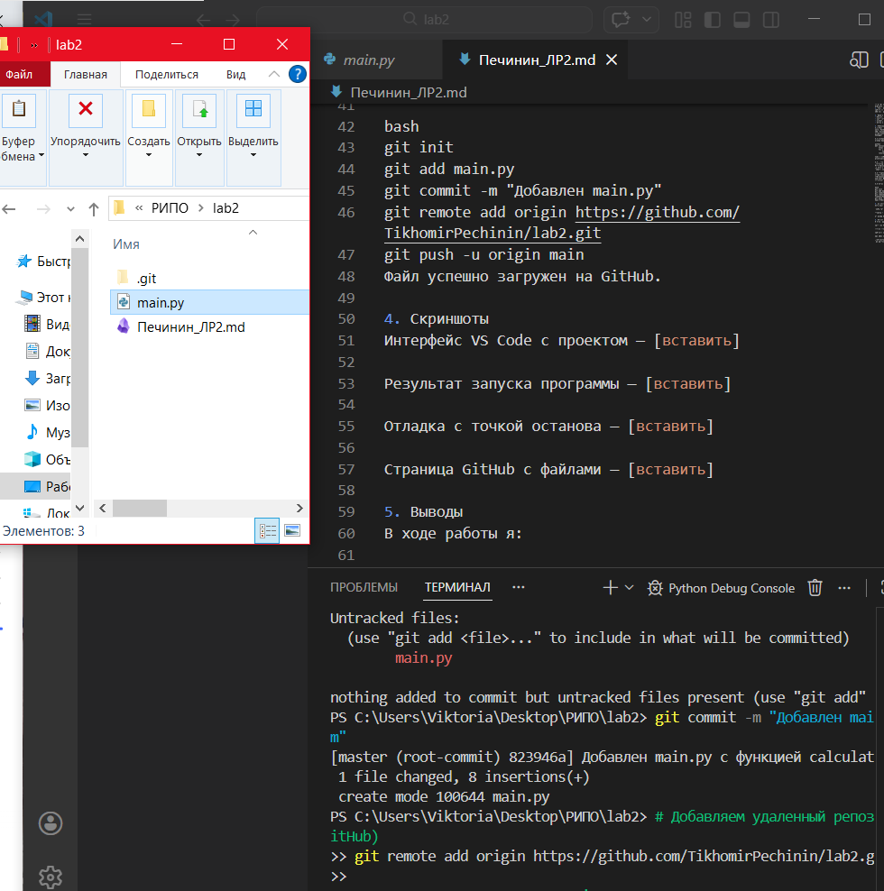
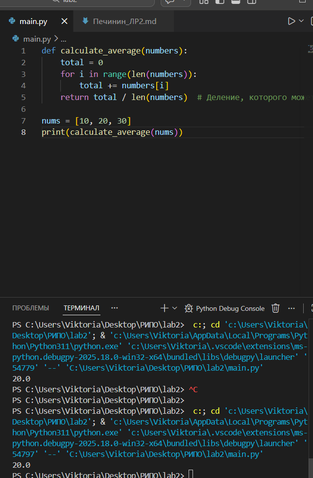
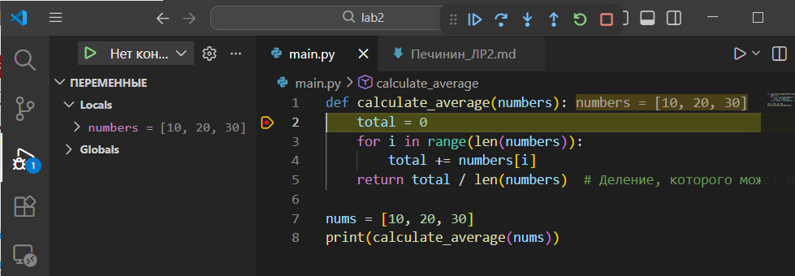

Отчет по лабораторной работе №2
Выполнил Печинин Тихомир
1. Цель работы
Научиться устанавливать, настраивать и использовать IDE для разработки инструментального ПО.

2. Задачи
- Выбрать и установить IDE.
- Настроить основные функции.
- Создать проект и протестировать отладку.
- Интегрировать с Git.

3. Выполненные операции
3.1 Выбор IDE
Язык: Python
IDE: Visual Studio Code
Установлены расширения: Python, Pylance, Python Debugger

3.2 Создание проекта
Создан файл main.py:

python
def calculate_sum(numbers):
    total = 0
    for i in range(len(numbers)):
        total += numbers[i]
    return total / len(numbers)

nums = [10, 20, 30]
print(calculate_sum(nums))

3.3 Проверка функций редактора
Подсветка синтаксиса ✅
Автодополнение ✅
Переход к определению (F12) ✅
Рефакторинг (F2) ✅

3.4 Отладка
Установлена точка останова, выполнено пошаговое выполнение (F10). В окне VARIABLES отслеживались значения переменных. Выявлена ошибка: функция вычисляет среднее, а не сумму.

3.5 Интеграция с Git

bash
git init
git add main.py
git commit -m "Добавлен main.py"
git remote add origin https://github.com/TikhomirPechinin/lab2.git
git push -u origin main
Файл успешно загружен на GitHub.

4. Скриншоты
Интерфейс VS Code с проектом — []

Результат запуска программы — []

Отладка с точкой останова — []

Страница GitHub с файлами — [вставить]

5. Выводы
В ходе работы я:
- настроил VS Code для Python;
- освоил основные функции редактора;
- научился использовать отладчик для поиска ошибок;
- закрепил навыки работы с Git.
Полученные навыки необходимы для эффективной разработки ПО.